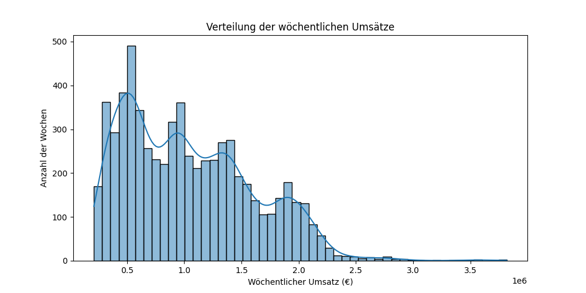
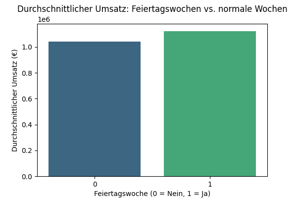
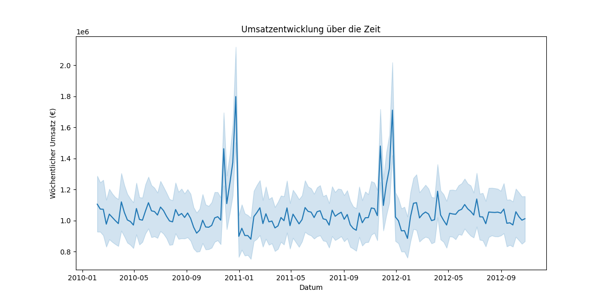

# 📊 Walmart Sales Analysis – Umsatz und externe Faktoren 🛒

Dieses Projekt wurde als **persönliches Data-Analytics-Referenzprojekt** erstellt,  
um anhand realer Verkaufsdaten typische Schritte der **Explorativen Datenanalyse (EDA)** durchzuführen und die Ergebnisse verständlich aufzubereiten.

Untersucht werden die **wöchentlichen Umsätze von Walmart-Filialen in den USA** sowie der **Einfluss von Feiertagen, Wetter und wirtschaftlichen Faktoren** wie **Benzinpreis, Verbraucherpreisindex (CPI)** und **Arbeitslosenquote**.

---

## 🚀 Ziel des Projekts
- Wie verteilen sich die **wöchentlichen Umsätze** über die Filialen?
- Haben **Feiertage** spürbaren Einfluss auf die Umsätze?
- Gibt es **Filialen, die besonders herausstechen** (sehr hohe oder niedrige Umsätze)?
- **Beeinflussen externe Faktoren** wie **Wetter, Benzinpreis oder Arbeitslosigkeit** die Umsätze?

---

## 📂 Projektstruktur
- `data/` – Rohdaten (`Walmart.csv`)
- `notebooks/` – Explorative Datenanalyse in Jupyter Notebooks (`walmart_analysis.ipynb`)
- `visuals/` – Diagramme und Plots als PNG-Dateien
- `scripts/` – Python-Skripte (optional)

---

## 📊 Ergebnisse (Auswahl)

---

### 🔸 Umsatzverteilung (pro Filiale/Woche)
Die **Umsätze variieren stark** zwischen den Filialen:
- **Kleinste Filiale ca. 210.000 € pro Woche**
- **Größte Filiale bis zu 3,8 Mio € pro Woche**
- **Median: ca. 960.000 €**, **Durchschnitt: ca. 1.046.000 €**  
  → **Große Filialen ziehen den Schnitt nach oben**.

**Visualisierung:**  


---

### 🔸 Feiertagswochen vs. normale Wochen
- **Feiertagswochen haben ca. +8% höheren Umsatz** als normale Wochen.
- Feiertage wie **Weihnachten, Black Friday oder Thanksgiving** sind vermutlich die Treiber.

**Visualisierung:**  


---

### 🔸 Umsatztrend über die Zeit
- **Peaks sichtbar** → besonders um Feiertage.
- **Generell stabile Umsätze**, aber **leichte Schwankungen** über die Wochen.

**Visualisierung:**  


---

### 🔸 Externe Faktoren (Temperatur, Benzinpreis, Arbeitslosenquote)
- **Kein klarer kurzfristiger Zusammenhang erkennbar**.
- **Supermarkteinkäufe sind oft routiniert** → kurzfristige externe Faktoren weniger entscheidend.

---

## 📦 Installation & Nutzung
Falls du die Analyse lokal nachverfolgen willst:

```bash
pip install pandas matplotlib seaborn jupyter
jupyter notebook notebooks/walmart_analysis.ipynb
```

---

## 📊 Datenquelle
Die Daten stammen von **Kaggle**:  
🔗 [Walmart Sales Dataset](https://www.kaggle.com/datasets/yasserh/walmart-dataset)
